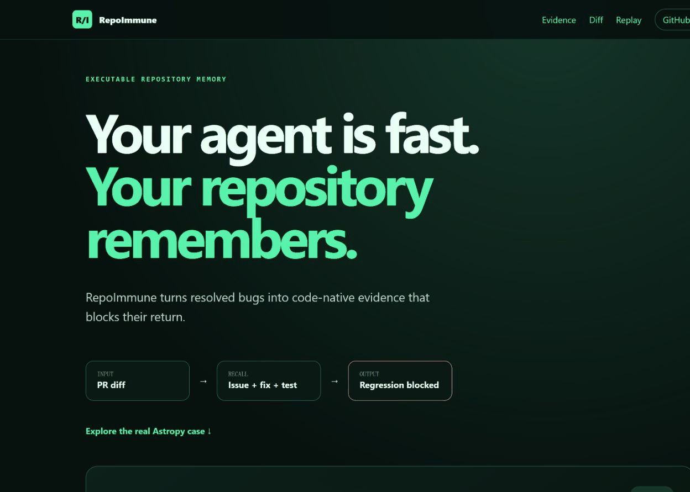
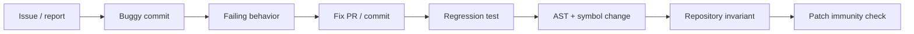

<p align="center">
  
</p>

<p align="center"><strong>Give your coding agent a memory of every bug your repository already fixed.</strong></p>

<p align="center">
  <a href="https://github.com/Alex0AI/RepoImmune/actions/workflows/ci.yml"></a>
  <a href="https://github.com/Alex0AI/RepoImmune/releases"></a>
  <a href="LICENSE"></a>
</p>

RepoImmune turns a repository's resolved bugs into code-native, evidence-backed checks that can be queried by humans and coding agents.

| Input | Processing | Output |
|---|---|---|
| A GitHub repository or PR diff | Retrieve historical issue → fix → test → AST evidence | Exact regression location, source links, protected tests, and the historical fix |



## 60-second quick start

```bash
git clone https://github.com/Alex0AI/RepoImmune.git
cd RepoImmune
python -m venv .venv
# Windows: .venv\Scripts\activate
# macOS/Linux: source .venv/bin/activate
python -m pip install -e .
repoimmune init .
repoimmune check --diff examples/reintroduce-astropy-12907.diff --memory examples/memory
repoimmune replay astropy-12907 --memory examples/memory
repoimmune report --format html
```

The demo is offline, keyless, and dependency-free at runtime. The check intentionally exits `2` because it finds a real historical regression from [Astropy PR #12907](https://github.com/astropy/astropy/pull/12907).

## What is executable memory?

A Behavior Card is not a chat summary. It binds an invariant to before/after code, AST form, exact symbols, regression tests, commits, source URLs, license, evidence class, and an optional replay capsule. RepoImmune refuses to promote a mined candidate when the evidence chain is incomplete.



The included vertical slice detects this exact reversion:

```diff
- cright[-right.shape[0]:, -right.shape[1]:] = right
+ cright[-right.shape[0]:, -right.shape[1]:] = 1
```

It reports the precise line, explains why the all-ones block was historically wrong, links the issue/PR/merge commit, and names the pytest cases added with the fix.

## CLI

```text
repoimmune init .
repoimmune mine --repo owner/project
repoimmune check --diff HEAD~1
repoimmune recall "pagination returns duplicate rows"
repoimmune explain <behavior-card-id>
repoimmune replay <capsule-id>
repoimmune report --format html
repoimmune validate <card.json>
```

`check` emits Markdown, JSON, or SARIF. `mine` saves conservative candidates only; it never calls an LLM and does not claim a Behavior Card from a title alone.

## Agent and CI integrations

- The composite [GitHub Action](action.yml) analyzes pull-request diffs read-only and uploads SARIF/Markdown evidence.
- The stdio MCP server exposes six structured, read-only tools: `search_past_failures`, `explain_code_history`, `check_patch_against_memory`, `list_invariants_for_file`, `get_regression_test`, and `replay_behavior_case`.
- The open [Agent Skill](skills/repoimmune/SKILL.md) asks an agent to recall history before risky edits and again before claiming completion. It grants no commit, push, merge, or test-bypass authority.
- The [static demo](https://alex0ai.github.io/RepoImmune/) works without login or an API key.

## Evidence classes

Every result is explicitly one of:

- `verified`: directly replayed or mechanically corroborated with primary code/test evidence.
- `externally_reported`: trusted upstream or benchmark execution record, not reproduced here.
- `heuristic`: useful candidate or similarity signal, not proof.
- `inconclusive`: conflicting or incomplete evidence.

A similarity score is never presented as proof. Findings always show the matched code and source evidence.

## Why this is different

- **Agent/chat memory:** remembers conversations or repository facts; RepoImmune mines code history and creates mechanical checks that outlive any agent session.
- **SWE-bench:** evaluates whether an agent can repair an issue; RepoImmune converts resolved issues into durable prevention assets.
- **Static analysis:** starts from general rules; RepoImmune learns repository-specific invariants from that repository's real failures.
- **Test generation:** may create tests; RepoImmune preserves the causal chain among report, buggy/fixed code, test, and invariant.
- **git blame:** tells who and when; RepoImmune explains why behavior must survive and can check it.

See [research-landscape.md](research-landscape.md) for the evidence-backed comparison.

## Security model

Issue text, PR comments, code, patches, and repository metadata are untrusted data. RepoImmune never evaluates them as instructions. Mining uses bounded HTTPS responses; refs and repository names are validated; capsule runs use fixed argv without a shell, reject absolute paths and symlinks, and time out. Unknown repositories' install scripts or tests are never run by default. See [SECURITY.md](SECURITY.md) and [docs/threat-model.md](docs/threat-model.md).

## Current scope and honest limits

The alpha deeply supports Python AST and pytest evidence. TypeScript/TSX has an optional pinned tree-sitter adapter for normalized structure and call extraction; JavaScript uses deterministic token structure, and Jest/Vitest can be recorded as test evidence. Whole-program interprocedural reachability, automatic upstream environment reconstruction, and broad language support are roadmap items. Dataset-scale cards are `externally_reported` until replayed; the bundled Astropy vertical slice is the only locally verified behavioral capsule in v0.1.0.

## Reproducibility

```bash
python scripts/build_research_snapshot.py --limit 500 --cards 120
python scripts/run_experiments.py
pytest
coverage run -m pytest && coverage report
ruff check . && mypy src/repoimmune
```

All published counts are regenerated into `research/results.json`; classifications and limitations are preserved, including unsuccessful or inconclusive cases. Data provenance lives in [DATA_SOURCES.md](DATA_SOURCES.md), [THIRD_PARTY.md](THIRD_PARTY.md), and [research/data-card.md](research/data-card.md).

The committed v0.1 snapshot contains **500 candidates, 120 Behavior Cards, 12 repositories, and 30 lightweight structural capsules**. On deterministic mutations it detected 120/120 exact historical reversions and 120/120 protected assertion deletions; same-symbol fixed-form refactors produced 9/120 false positives (7.5%). Title-derived retrieval reached Recall@5/MRR 1.0/1.0, but this is explicitly a same-source plumbing test. Independent mining precision and controlled Agent A/B remain inconclusive.

## Contributing

Read [CONTRIBUTING.md](CONTRIBUTING.md), the [roadmap](ROADMAP.md), and the Behavior Card schema before proposing a new miner or evidence source. Apache-2.0 licensed.

中文说明：[README.zh-CN.md](README.zh-CN.md)
