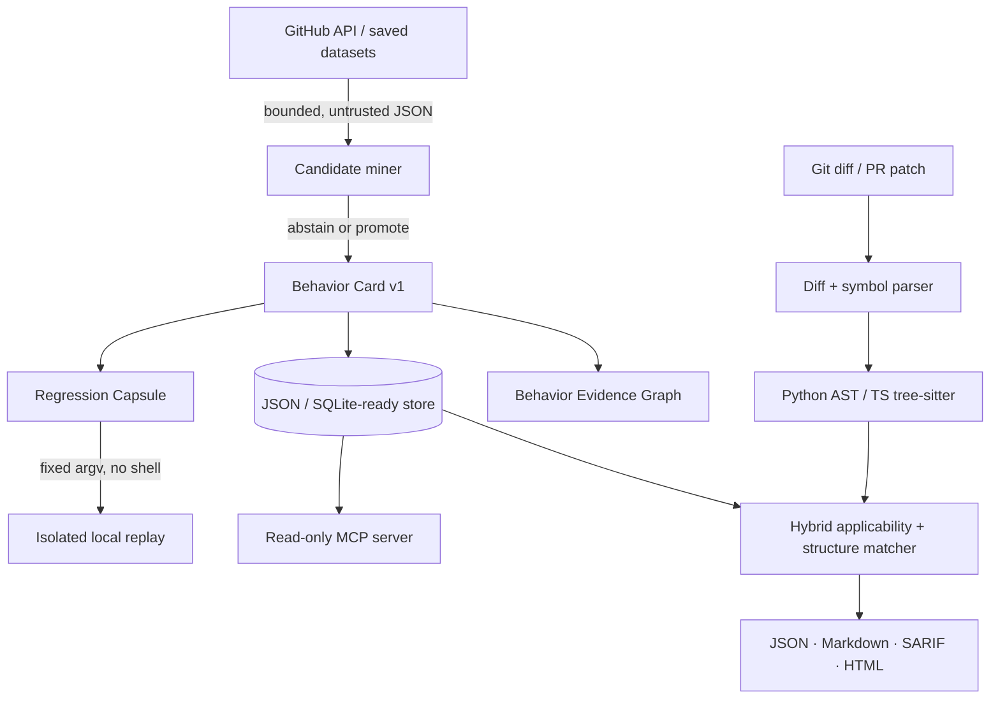

# Architecture

The core has no external service or database requirement. JSON cards are deterministic and SQLite can be added as an index without becoming the source of truth. Network mining, local checking and capsule execution are separate trust zones. The checker never executes repository code; the capsule runner only executes reviewed files already under its capsule root.

## Language adapters

- Python: stdlib AST normalization, symbol hunk context and call extraction.
- TypeScript/TSX: optional pinned tree-sitter grammar produces normalized CST/AST fingerprints and call expressions. Without the optional extra, token structure is a disclosed fallback.
- JavaScript: deterministic token structure in v0.1; the dedicated tree-sitter JavaScript adapter is planned.

